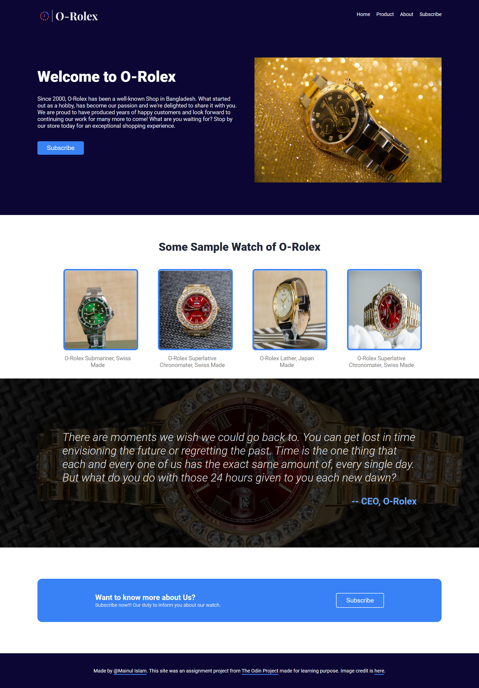

# odin-rolex
This is a landing page assignment from The Odin Project

Solution for the [PROJECT: LANDING PAGE](https://www.theodinproject.com/paths/foundations/courses/foundations/lessons/landing-page) from the [Foundations](https://www.theodinproject.com/paths/foundations/courses/foundations) part of [The Odin Project](https://www.theodinproject.com/).

## Table of contents

- [Overview](#overview)
  - [Requirement](#project-requirement)
  - [Solution Screenshot](#solution-screenshot)
  - [Links](#links)
- [My process](#my-process)
  - [Built with](#built-with)
  - [What I learned](#what-i-learned)
  - [Continued development](#continued-development)
  - [Useful resources](#useful-resources)
- [Author](#author)
- [Image Credit](#image-credit)

### Project-Requirement

The final output should look like the following. Design can be changed but the structure should be like the following:

### Solution Screenshot

The final output:

Currently it's only for Desktop. I'll make responsive later

### Links

Live Site URL: [Live site of the challenge hosted here](https://mainul-islam-nirob.github.io/odin-rolex/)

## My process

Hello, this is my 1'st project here in The Odin Project. It's a simple landing page. 

### Built with

- Basic HTML5 markup
- Basic CSS
- FlexBox

### What I learned

Although it wasn't new to me. I've completed this kind of project previously from Frontend Mentors and other source. But I believe I've learned something new today.
`box-shadow:inset 0 0 0 2000px rgba(0, 0, 0, 0.774);` 
this css was new that I haven't used ever in my code for showing color overlay for background image. I've used Linear Gradient instead.

### Continued development

I want to focus more on creating more complex designs.

## Author

- Website - Well I haven't made my profile portfolio, gonna make it sooon when I know a lot of stuffs
- LinkedIn - [@mainul islam](https://www.linkedin.com/in/mainul-islam-nirob/)
- Frontend Mentor - [@mainul](https://www.frontendmentor.io/profile/Mainul-Islam-Nirob)
- Twitter - [@mainul](https://twitter.com/Mainuli96601040)
- FreeCodeCamp - [@mainul](https://www.freecodecamp.org/mainul)

## Image Credit

All Product Photo and Quote Background Photo by Antony Trivet from Pexels. 
Header Section Image by <a href="https://pixabay.com/users/5598375-5598375/?utm_source=link-attribution&amp;utm_medium=referral&amp;utm_campaign=image&amp;utm_content=3005574">5598375</a> from <a href="https://pixabay.com/?utm_source=link-attribution&amp;utm_medium=referral&amp;utm_campaign=image&amp;utm_content=3005574">Pixabay</a>

